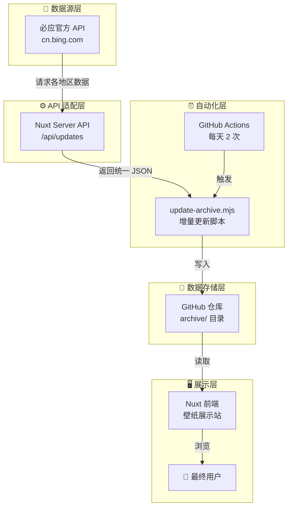

# Bing Wallpaper Archive
> 一个基于 Nuxt3 + Vercel + GitHub Actions 的**全自动壁纸展示**

---

## 📖 目录

- [项目概述](#项目概述)
- [技术架构](#技术架构)
- [数据流详解](#数据流详解)
- [部署指南](#部署指南)
- [配置说明](#配置说明)
- [API 接口文档](#api-接口文档)
- [运维与监控](#运维与监控)
- [常见问题](#常见问题)

---

## 项目概述


一个**全自动的必应壁纸数据中台**，每天定时从必应官方抓取全球 9 个地区的壁纸元数据，清洗后存入 `archive/` 目录，并通过优雅的 Web 界面展示。


```
https://bing.api.hangdn.com/api/image.random?mkt=zh-CN
https://bing.api.hangdn.com/api/image.random?mkt=en-US
https://bing.api.hangdn.com/api/image.random?mkt=de-DE
https://bing.api.hangdn.com/api/image.random?mkt=en-CA
https://bing.api.hangdn.com/api/image.random?mkt=en-GB
https://bing.api.hangdn.com/api/image.random?mkt=en-IN
https://bing.api.hangdn.com/api/image.random?mkt=fr-FR
https://bing.api.hangdn.com/api/image.random?mkt=it-IT
https://bing.api.hangdn.com/api/image.random?mkt=ja-JP

```
## API接口

/api/images?mkt=zh-CN&random=true，	返回随机壁纸 JSON 

/api/image.random?mkt=zh-CN	，直接返回随机壁纸图片 

/api/random?mkt=zh-CN	，返回随机壁纸 JSON	 

/api/random?mkt=zh-CN&redirect=true，	重定向到随机壁纸图片 

api/daily?mkt=zh-CN&redirect=true，重定向今日壁纸图片


### 核心能力

| 能力 | 说明 |
|------|------|
| 🔄 **自动化数据采集** | GitHub Actions 每天 2 次自动运行 |
| 🌍 **多语言支持** | 9 个地区独立数据（zh-CN, en-US, ja-JP 等） |
| 📦 **增量更新** | 只写入新数据，不重复处理历史记录 |
| 🖼️ **即开即用的前端** | Nuxt3 构建的壁纸展示站 |
| 🚀 **一键部署** | Fork 后配置 Variables 即可运行 |

### 技术栈

| 层级 | 技术选型 | 说明 |
|------|----------|------|
| **前端框架** | Nuxt 3 | Vue 3 + TypeScript |
| **部署平台** | Vercel | 自动构建 + 无服务器函数 |
| **数据更新** | GitHub Actions | 定时任务 + Git 自动提交 |
| **数据存储** | GitHub 仓库 | `archive/` 目录下的 JSON 文件 |
| **数据源** | 必应官方 API | `HPImageArchive.aspx` |
| **样式方案** | UnoCSS | 原子化 CSS |

---

## 技术架构

### 整体架构图



### 分层职责

| 层级 | 职责 | 关键文件 |
|------|------|----------|
| **数据源层** | 提供原始壁纸元数据 | 必应官方 API |
| **API 适配层** | 抓取、清洗、格式化数据 | `server/api/updates.get.ts` |
| **数据存储层** | 持久化存储壁纸数据 | `archive/{lang}/{month}.json` |
| **自动化层** | 定时拉取并更新数据 | `.github/workflows/update-archive.yml` |
| **展示层** | 提供用户界面 | `pages/[[date]].vue` |

---

## 数据流详解

### 1. API 适配层（服务端）

**文件位置**：`server/api/updates.get.ts`

**核心逻辑**：
1. 接收 `idx` 参数（当前未使用，保留扩展）
2. 向必应官方 API 请求 9 个地区的当天壁纸
3. 提取 `url`、`date`、`lang`、`title`、`copyright` 字段
4. 返回统一格式的 JSON 数组

**请求示例**：
```http
GET /api/updates?idx=0
```

**响应示例**：
```json
[
  {
    "url": "https://www.bing.com/th?id=OHR.xxx_ZH-CNxxx_1920x1080.jpg",
    "date": "2026-08-09",
    "lang": "zh-CN",
    "title": "壁纸标题",
    "copyright": "版权信息",
    "copyrightlink": "https://www.bing.com/search?q=..."
  }
]
```

### 2. 数据更新脚本

**文件位置**：`scripts/update-archive.mjs`

**工作流程**：
1. 从环境变量 `API_ENDPOINT` 读取 API 地址
2. 请求 `{API_ENDPOINT}/api/updates?idx=0`
3. 解析返回的 JSON 数组
4. 遍历数组，按 `lang` 和 `date` 写入 `archive/`
5. 已存在的日期自动跳过（幂等操作）

**目录结构示例**：
```
archive/
├── zh-CN/
│   └── 202608.json          # { "20260809": {...}, "20260808": {...} }
├── en-US/
│   └── 202608.json
└── ja-JP/
    └── 202608.json
```

### 3. 自动化调度

**文件位置**：`.github/workflows/update-archive.yml`

**调度策略**：
- **定时触发**：每天 UTC 12:00（北京时间 20:00）
- **手动触发**：支持 `workflow_dispatch`

**运行步骤**：
1. 检出代码
2. 设置 Node.js 环境
3. 运行 `update-archive.mjs`
4. 提交并推送变更

---

## 部署指南

### 前置条件

- GitHub 账号
- Vercel 账号（免费）
- Fork 上游仓库 `jsonleex/bing.wallpaper`

### 步骤一：Fork 并配置 Variables

1. **Fork 仓库**：访问 `https://github.com/jsonleex/bing.wallpaper`，点击 Fork。

2. **配置 Variables**：进入仓库 **Settings → Secrets and variables → Actions → Variables**，添加以下三个变量：

| Name | Value | 说明 |
|------|-------|------|
| `API_ENDPOINT` | `https://你的域名` | API 服务地址（部署后更新） |
| `USER_NAME` | `你的GitHub用户名` | Git 提交作者 |
| `USER_EMAIL` | `你的GitHub邮箱` | Git 提交邮箱 |

### 步骤二：部署 API 服务到 Vercel

1. **登录 Vercel**：访问 `https://vercel.com`，用 GitHub 账号登录。

2. **导入项目**：点击 **Add New → Project**，选择你 Fork 的仓库。

3. **配置构建**：
   - Framework Preset：**Nuxt.js**（Vercel 自动识别）
   - Build Command：`npm run build`
   - Output Directory：`.output/public`

4. **点击 Deploy**：等待部署完成。

5. **获取你的 API 地址**：部署完成后，Vercel 会分配一个域名（如 `https://bing-wallpaper-xxx.vercel.app`）。你的 API 端点就是：
   ```
   https://bing-wallpaper-xxx.vercel.app/api/updates?idx=0
   ```

### 步骤三：更新 Variables

回到 GitHub 仓库，将 `API_ENDPOINT` 更新为你的 Vercel 域名：
```
https://bing-wallpaper-xxx.vercel.app
```

### 步骤四：测试运行

1. 进入 GitHub 仓库的 **Actions** 页面
2. 选择 **Update Archive** 工作流
3. 点击 **Run workflow** → **Run workflow**
4. 等待 10-20 秒，确认状态为 ✅ **succeeded**

---

## 配置说明

### 环境变量（GitHub Variables）

| 变量名 | 必需 | 说明 |
|--------|------|------|
| `API_ENDPOINT` | ✅ | API 服务的基础 URL（不含 `/api/updates`） |
| `USER_NAME` | ✅ | Git 提交的用户名 |
| `USER_EMAIL` | ✅ | Git 提交的邮箱 |

### 工作流配置（`.github/workflows/update-archive.yml`）

```yaml
name: Update Archive

on:
  schedule:
    - cron: '0 12 * * *'      # UTC 12:00 = 北京时间 20:00
  workflow_dispatch:           # 支持手动触发
```

**修改调度时间**：
```yaml
- cron: '0 22 * * *'          # UTC 22:00 = 北京时间 06:00（次日）
```

### 支持的语言列表

| 语言代码 | 目录名 | 说明 |
|----------|--------|------|
| `zh-CN` | `zh-CN` | 简体中文（中国） |
| `en-US` | `en-US` | 英语（美国） |
| `en-GB` | `en-GB` | 英语（英国） |
| `ja-JP` | `ja-JP` | 日语（日本） |
| `de-DE` | `de-DE` | 德语（德国） |
| `fr-FR` | `fr-FR` | 法语（法国） |
| `it-IT` | `it-IT` | 意大利语（意大利） |
| `en-CA` | `en-CA` | 英语（加拿大） |
| `en-IN` | `en-IN` | 英语（印度） |

---

## API 接口文档

### 端点信息

| 属性 | 值 |
|------|-----|
| **路径** | `/api/updates` |
| **方法** | `GET` |
| **认证** | 无 |
| **缓存** | 无（实时抓取） |

### 请求参数

| 参数 | 类型 | 必需 | 默认值 | 说明 |
|------|------|------|--------|------|
| `idx` | `number` | ❌ | `0` | 分页索引（保留扩展） |

### 响应格式

- **Content-Type**：`application/json`
- **数据结构**：对象数组

```typescript
interface UpdateItem {
  url: string        // 壁纸图片 URL
  date: string       // 日期（YYYY-MM-DD）
  lang: string       // 语言代码（如 zh-CN）
  title: string      // 壁纸标题
  copyright: string  // 版权信息
  copyrightlink: string // 版权链接
}
```

### 响应示例

```json
[
  {
    "url": "https://www.bing.com/th?id=OHR.JMTjibaou_ZH-CN6992670356_1920x1080.jpg",
    "date": "2026-08-09",
    "lang": "zh-CN",
    "title": "身份认同的建筑表达",
    "copyright": "让-马里·吉巴乌文化中心，新喀里多尼亚 (© Fabien Astre/Alamy)",
    "copyrightlink": "https://www.bing.com/search?q=..."
  }
]
```

### 测试命令

```bash
curl https://your-domain.vercel.app/api/updates?idx=0
```

---

## 运维与监控

### 验证数据更新

1. 访问你的 Vercel 网站，查看壁纸是否更新。
2. 检查 GitHub 仓库的 `archive/` 目录，确认新增了当天的数据文件。
3. 查看 Actions 运行日志，确认状态为 `succeeded`。

### 常见日志解读

| 日志内容 | 含义 |
|----------|------|
| `+ 20260809 added` | 新增了某天的壁纸数据 |
| `! 20260809 already exists` | 该天数据已存在（幂等跳过） |
| `# applying 9 updates` | 本次拉取了 9 条更新 |
| `Everything up-to-date` | 没有新数据需要提交 |

### 故障排查

| 问题 | 排查步骤 |
|------|----------|
| `Missing API_ENDPOINT` | 检查 GitHub Variables 是否配置了 `API_ENDPOINT` |
| `USER_NAME` / `USER_EMAIL` 错误 | 检查变量名是否完全匹配（大小写敏感） |
| API 请求失败 | 访问 `https://你的域名/api/updates?idx=0` 测试是否正常 |
| 数据未更新 | 检查 Actions 日志，确认工作流是否成功运行 |

---

## 常见问题

### Q1：为什么需要自己部署 API 服务？

上游作者的 API (`https://img6.zone.id`) 虽然是公开的，但依赖他人服务存在不确定性。自己部署后，项目**完全自给自足**，不受第三方影响。

### Q2：Vercel 部署需要付费吗？

不需要。Vercel 的 Hobby 计划对个人项目完全免费，支持：
- 每天 100GB 带宽
- 无服务器函数调用次数充足
- 自动 SSL 证书

### Q3：如何更新支持的语言列表？

修改 `server/api/updates.get.ts` 中的 `LANGUAGES` 数组即可。

### Q4：数据会重复写入吗？

不会。脚本会检查 `archive/{lang}/{month}.json` 中是否已存在该日期，存在则跳过。

### Q5：可以只抓取中文数据吗？

可以。在 `updates.get.ts` 中只保留 `zh-CN` 即可，其他地区注释掉。

### Q6：如何绑定自定义域名？

在 Vercel 项目设置中添加域名，按提示配置 DNS 的 CNAME 记录即可。

---

## 项目地址

| 组件 | 地址 |
|------|------|
| **GitHub 仓库** | `https://github.com/你的用户名/bing.wallpaper` |
| **Vercel 前端** | `https://你的域名.vercel.app` |
| **API 端点** | `https://你的域名.vercel.app/api/updates?idx=0` |

---

## 致谢

- 上游项目 `jsonleex/bing.wallpaper` 提供的优秀架构
- `zkeq/Bing-Wallpaper-Action` 等开源项目提供的数据源思路
- Vercel 和 GitHub 提供的免费基础设施


<details>
<summary>github原项目readme.md（点击展开）</summary>
# Bing Wallpaper Archive

- ⚒️ Nuxt3 + Vercel
- 🚀 https://img6.zone.id

## Features

- [x] 🔄 Auto update daily
- [x] 🇺🇳 Support multiple languages
- [x] 🏞️ Support multiple resolutions

## Data Source

- [zkeq/Bing-Wallpaper-Action](https://github.com/zkeq/Bing-Wallpaper-Action/tree/main/data)
- [flow2000/bing-wallpaper-api](https://github.com/flow2000/bing-wallpaper-api/tree/master/data)
- [zenghongtu/bing-wallpaper](https://github.com/zenghongtu/bing-wallpaper/blob/main/json/data.json)

## Thanks

- Free domain by [Zone.ID](https://www.zone.id/)

</details>
